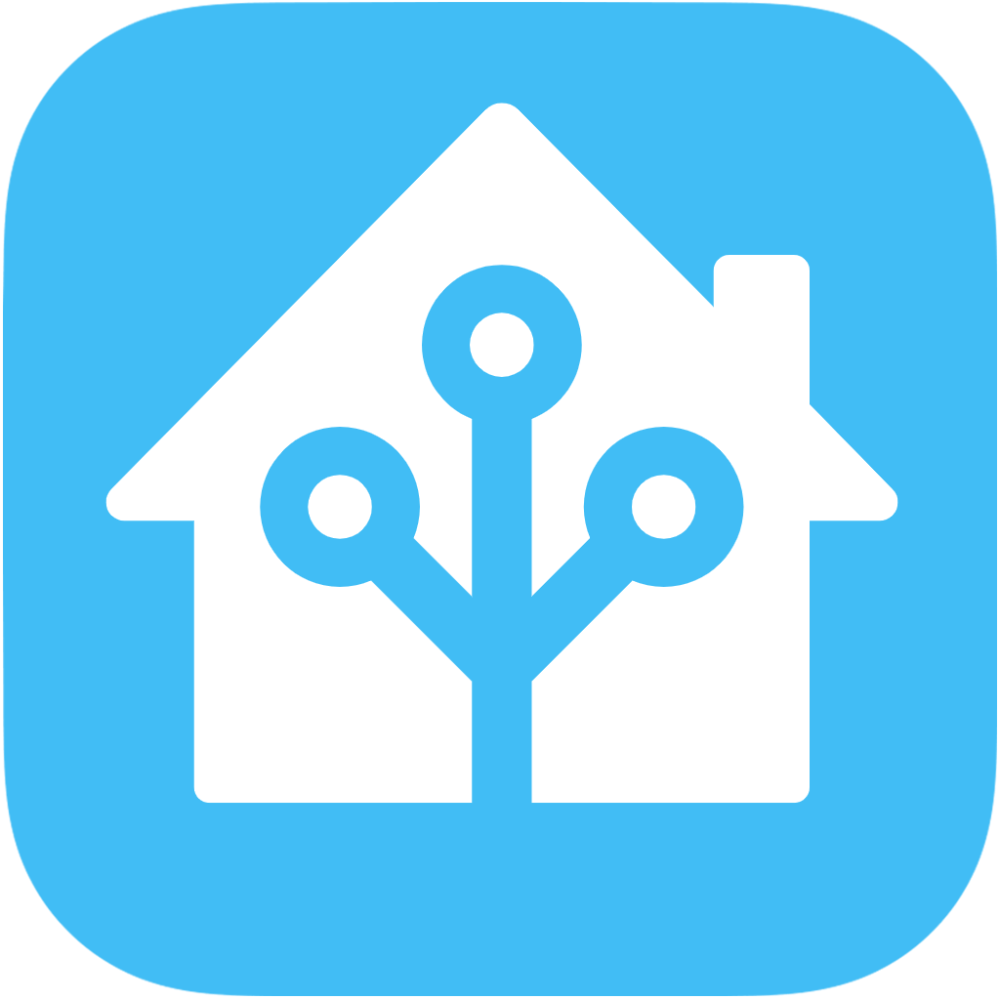
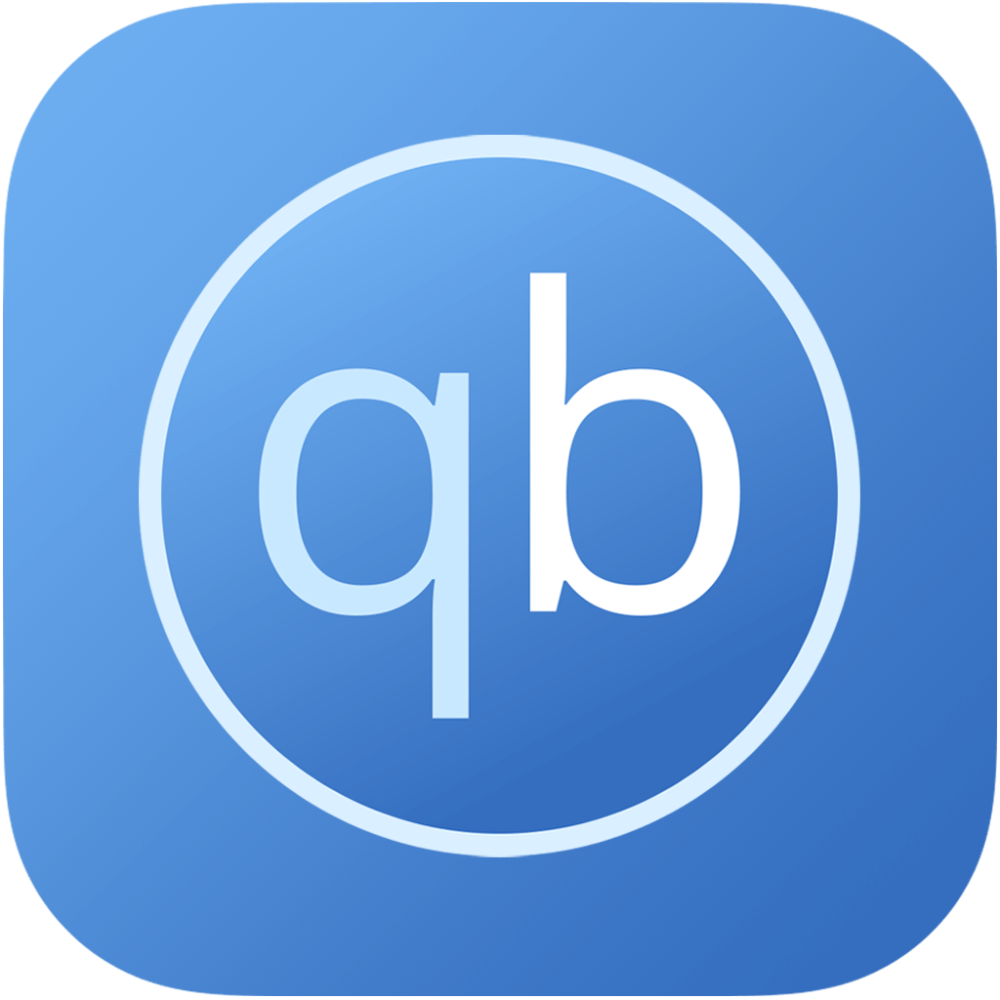
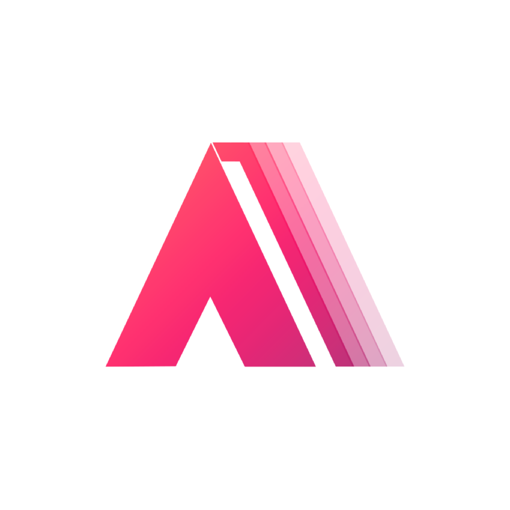
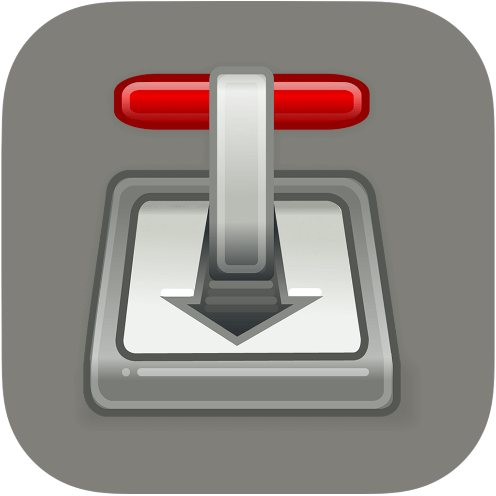
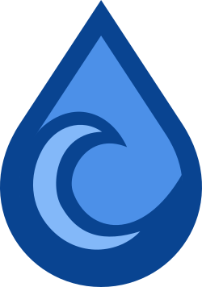
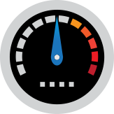
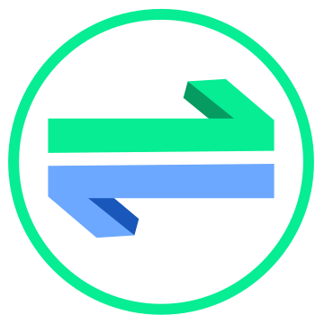

  <h3 align = "center" > 高清仪表盘图标 </h3>
  

      
      
      
  

  

      1024x1024 分辨率，已经过无损压缩处理。
  
    <a href="#圆角矩形图标"> <strong > 已有图标预览 »</strong> </a>
  
  

  

  
  

# 目录
- [说明](#说明)
- [使用方法](#使用方法)
- [图标预览](#圆角矩形图标)
- [声明](#声明)

<!-- GETTING STARTED -->
# 说明
- 首先感谢“<a herf="https://github.com/xushier/HD-Icons">煦诗儿</a>”提供图标。本项目是在其基础上增添个人常用图标使用。
- 本项目建立初衷是为了用于本人 `Unraid Docker` 容器使用，当然，任何需要的地方也都可以用。
- 图标分辨率为 `1024x1024`。所有图标都已经过 **无损压缩** 处理。
- 图标主体适当放大，Unraid 系统上看起来图标主体更加突出。
- `border-radius` 文件夹包含圆角矩形图标，`circle` 文件夹包含圆形图标。

# 使用方法

## 使用远程链接（后续更新同步显示，推荐）
1. 使用 Github 原始的图标链接，适用于可以访问 Github 的用户。
   - Github 项目地址：https://github.com/huantian123/Icon
   - 例如：`https://raw.githubusercontent.com/huantian123/Icon/main/border-radius/xxxxx.png`

# 图标预览（当前共计 1228 个）
## 圆角矩形图标
<!-- START BORDER-RADIUS ICONS -->
<!-- -->
                                                                                                                                                                                                                                                                                                                                                                                                                                                                                                                                                                                                                                                                                                                                                                                                                                                                                                                               
<!-- END BORDER-RADIUS ICONS -->

## 圆形图标
<!-- START CIRCLE ICONS -->
<!-- -->
                                                                                                    
<!-- END CIRCLE ICONS -->

## SVG 图标
<!-- START SVG ICONS -->
        

    
    

        

        

        

        

        

        

        

        

        

        

        

        

        

        

        

        

        

        

        

        

        

            

            

        

        

       
<!-- END SVG ICONS -->
<!-- LEGAL -->

# 声明
(Almost) All product names, trademarks and registered trademarks in the images in this repository, are property of their respective owners. All images in this repository are used by the users of the Dashboard Icons project for identification purposes only.

The use of these names, trademarks and brands appearing in these image files, do not imply endorsement.

---

